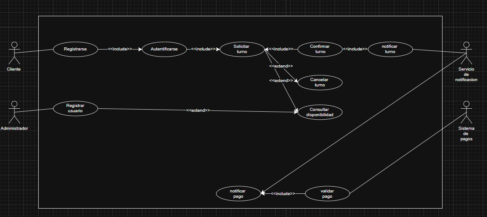

# Tunomatico - Sistemas de gestion de Turnos Digitales

## 1.- Descripcion General del sistema 

**Tunomatico** es una solucion de sooftware empresarial diseñada para optimizar, automatizar y gestionar el ciclo de vida completo de la asignacion de turnos y citas digitales. el sistema aborda la problematica de la congestion en la atencion presencial, la ineficiencia en la distribucion de horarios y la falta de canales de comunicacion automatizados con los usuarios.

### Objetivos Arquitectonicos 
* **Alta disponibilidad y concurrencia:** Asegurar el acceso simultaneo de multiples usuarios garantizando la consistencia de estado de los turnos sin colisiones de reserva. 
* **Escalabilidad e Intercoperatividad:** permitir la integracion modular con proveedores externos de pasarelas de pago y servicios de mensajeria (SMS/Email) mediante un bajo acoplamiento.
* **Mantenibilidad:** estructurar el dominio aplicando patrones de diseño Gof (*Gang of Four*) para facilitar la extension del sofware sin alterar el nucleo del negocio.

------------------------------

## 2.- Modelo de Requisitos: Diagrama de casos de uso

El diagrama de casos de uso define los limites del sistema y la interaccion de los actores con las funcionalidades de la plataforma.

