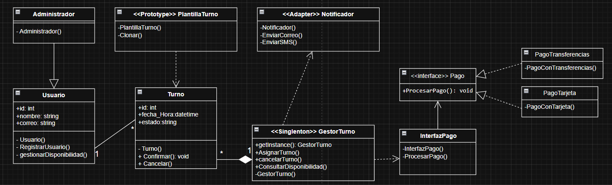
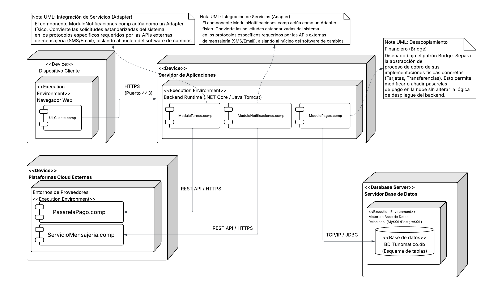

# Tunomatico - Sistemas de gestion de Turnos Digitales

## 1.- Descripcion General del sistema 

**Tunomatico** es una solucion de sooftware empresarial diseñada para optimizar, automatizar y gestionar el ciclo de vida completo de la asignacion de turnos y citas digitales. el sistema aborda la problematica de la congestion en la atencion presencial, la ineficiencia en la distribucion de horarios y la falta de canales de comunicacion automatizados con los usuarios.

### Objetivos Arquitectonicos 
* **Alta disponibilidad y concurrencia:** Asegurar el acceso simultaneo de multiples usuarios garantizando la consistencia de estado de los turnos sin colisiones de reserva. 
* **Escalabilidad e Intercoperatividad:** permitir la integracion modular con proveedores externos de pasarelas de pago y servicios de mensajeria (SMS/Email) mediante un bajo acoplamiento.
* **Mantenibilidad:** estructurar el dominio aplicando patrones de diseño Gof (*Gang of Four*) para facilitar la extension del sofware sin alterar el nucleo del negocio.

------------------------------

## 2.- Modelo de Requisitos: Diagrama de casos de uso

El diagrama de casos de uso define los limites del sistema y la interaccion de los actores con las funcionalidades de la plataforma.

### Descripcion y justificacion de relaciones

* **Actores de negocio (Cliente y Administrador):** Representan los agentes externos autonomos. El `Cliente` interactua principalmente con el ciclo de vida de su cita (`Registrarse`,`Solicitar Turno`), mientras que el `administrador`posee un caso de uso exclusivo (`Registrar usuario`) para el control operacional y de personal dentro de la plataforma.
* **Actores del sistema (servicio de notificacion y sistema de pagos):** Actores secundarios del tipo sistema (*system boundary*) que reaccionan de manera sincrona y asincrona ante los estimulos de bakend para procesar transacciones y despachar alertas.
* **Relaciones de inclusion (`<<include>>`):** El caso de uso `Confirmar Turno` incluye obligatoriamente a `Solicitar Turno` y `Notificar Turno`. Esto asegura que ninguna confirmacion de reserva sea consolidada en la base de datos sin una solicitud previa en el flujo y sin disparar la alerta correspondiente al cliente.
* En el subsistema financiero, `Validad pago` incluye mandatoriamente a `notificar pago`, garantizando la trazabilidad y el acuse de recibo de la transaccion de cara al usuario.
* **Relaciones de Extension (`<<extend>>`):** El caso de uso central `Solicitar Turno` es extendido de manera condicional por `Cancelar Turno` y `Consultar Disponibilidad`. Estas extenciones representan flujos alternativos que el cliente puede o no ejercutar dependiendo del estado de la sesion y la necesidad del negocio, evitando sobrecargar el flujo principal de reserva.

------------------------------

## 3.- Arquitectura logica: Diagrama de clases

El diseño logico del sistema se estructuro bajo el paradigma orientado a objetos, aplicando principios SOLID y garantizando un alto grado de cohesion.

### Justificacion profunda de patrones de diseño aplicados

para resolver problemas recurrentes de acoplamiento, creacion de objetos y manejo de estado, se implementaron de forma estricta los siguentes patrones de diseño:

#### A.-Patron creacional:`<<singleton>> GestorTurno`
* **Problema resuelto:** La concurrencia descontrolada al asignar citas simultaneas podria generar sobreventas o duplicidad de un mismo bloque horario en el servidor.
* **Solucion y justificacion:** se centralizo el control en las clase `GestorTurno` restringiendo su contructor a visibilidad privada (`-`) y exponiendo un punto de acceso global mediante el metodo estatico y publico `+getInstance(): GestorTurno`. Esto asegura una unica instancia de memorial global capaz de sincronizar y arbitrar la lectura/escritura de los estados de la clase `Turno`.

#### B.-Patron creacional: `<<Prototype>> PlantillaTurno`
* **Problema resuelto:** La instanciacion repetitiva y masiva de objetos `Turno` para un calendario anual genera un alto costo de procesamiento y sobrecarga las consultas estructurales a la base de datos.
* **Solucion y justificacion:** La clase `PlantillaTurno` encapsula la logica de clonacion mediante el metodo publico `+Clonar()`. El sistema configura un prototipo base con atributos genericos predeteminados y genera la parrilla de turnos mensuales duplicado dicho prototipo directamente en la memoria RAM, optimizando drasticamente el rendimiento del servidor.

#### C.-Patron estructural: `<<Adapter>> Notificador`
* **Problema resuelto:** Las APIs de proveedores externos de mensajeria (como twilio o sendGrind) modifican constantemente sus contratos de codigo o SDKs, lo qeu obligaria a refactorizar el nucleo del sistema ante cada actualizacion externa.
* **Solucion y justificacion:** la clase `Notificador` actua como un adaptador intermedio.
Encapsula las firmas y protocolos complejos de terceros bajo metodos estandarizados y publicos internamente (`+EnviarCorreo()`, `+EnviarSMS()`). El `GestorTurno` solo conoce la interfaz del adaptador, aislando por completo el dominio ante alteraciones de librerias externas.

#### D.-Patron estructural: `<<Bridge>> InterfazPago`
* **Problema resuelto:** Un acoplamiento directo entre el flujo de control financiero y las pasarelas de pago fisicas genera rigidez arquitectonica, impidiendo agregar nuevos metodos de pago sin alterar la logica de negocio existente.
* **Solucion y justificacion:** se aplico una separacion estricta entre la abstraccion y la implementacion. La clase `InterfazPago` maneja la logica de control operacional del negocio y se desacopla mediante una relacion de asociacion dirigida hacia la interfaz abstracta `<<Interface>> Pago`. Las imprementaciones concretas de la plataforma (`PagoTransferencias` y `PagoTarjeta`) realizan dicha interfaz mediante una relacion de realizacion formal (`- - ->`). Esto faculta la adiccion o intercambio de mecanismos fisicos de recaudacion en tiempo de ejecucion sin alterar el codigo de la capa de abstraccion.

------------------------------

## 4.-Arquitectura fisica: Diagrama de Implementacion

El diagrama de implementacion modela la distribucion fisica del software en los nodos de hardware, detallando los entornos de ejecucion y los protocolos de red que soportan la carga transaccional.

 

### Decisiones tecnicas y componentes desplegados

La topologia del sistema se diseño bajo un modelo de arquitectura distribuida en tres capas para garantizar seguridad y escalabilidad horizontal:

| Nodo Fisico (`<<device>>`) | Entorno de ejecucion (`<<execution environment>>`) | componentes albergados | protocolo de coneccion |
| :--- | :--- | :--- | :---|
| **Dispocitivo Cliente** *(PC / Smartphone)*  | Navegador web (chrome, safari, etc.) | `UI_Cliente.com` | **HTTPS (Puerto 443):** cifrado TLS para asegurar la confidencialidad de los datos de usuario hacia el servidor web. | 
| **Servidor de aplicaciones** | Backend runtime (.NET core / java tomcat) | `ModuloTurnos.comp`   `ModuloNotificaciones.comp`   `ModuloPago.comp` | **TCP/IP / JDBC:** canal privado de comunicacion dedicado para persistencia de datos. | 
| **Servidor Base de Datos** | Motor de base de datos relacional (MySQL / PostgreSQL) | `BD_Turnomatico.bd` (esquema de tablas) | **REST API / HTTPS:** conexcion saliente segura desde el servidor backend hacia nubes de terceros. | 
| **Plataformas cloud externas** | entornos de proveedores (pasarelas de pago 7 APIs SMS) | `PasarelaPago.comp` `ServicioMensajeria.comp` | - |

> **Nota de seguridad arquitectonica:** El servidor de base de datos se encuentra aislado dentro de una subred privada. No posee direccionamiento IP publico, lo que mitiga vectores de ataques externos; toda peticion obligatoriamente debe ser autenticada y canalizada a traves del servidor de aplicaciones.

------------------------------

## 5.-Reflexiones finales del modelado

El proceso de modelado arquitectonico de **Turnomatico** demuestra de manera empirica que **el diseño de software previo a la fase de codificacion no es un gasto de tiempo, sino una inversion de mitigacion de riesgos**.

